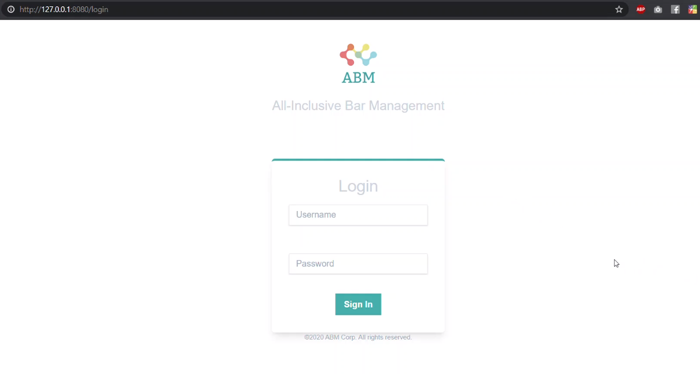
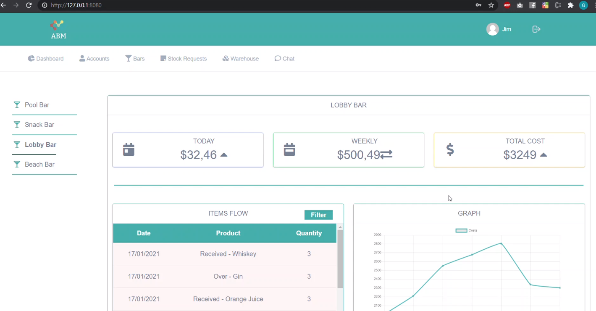
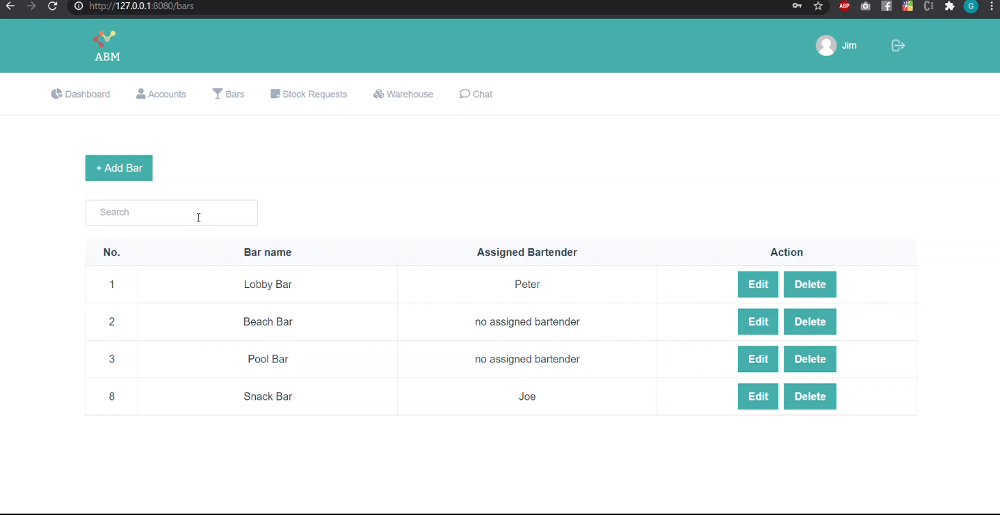
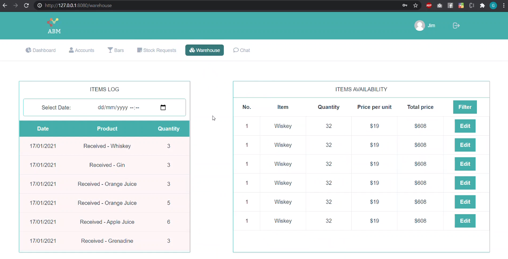

# All-inclusive Bar Management System

This repository contains my semester 3 individual project - ABM (All-inclusive Bar Management System). It is built using Java, Jakarta RESTful Web Services and Hibernate ORM on the backend and Vue.js 3 and Tailwind CSS for the front-end. 

This system is designed to be used for management of bars within all-inclusive hotels. The system is designed for 4 types of employees: bar manager, head bartender, warehouse keeper and bar supplier.
Through this system Bar Manager will be able to track all processes related to stock movement, bar management and stock finances. He will also be able to do the administration work like creating employee accounts, and bars as well as assigning head bartenders to the bars. The head bartender is responsible for marking in the system when an entity of stock is over on the bar. When the bar runs out of a certain stock the system automatically makes a stock request to the warehouse keeper. The warehouse keeper is responsible for receiving stock in the warehouse and reviewing stock requests from the bars. He decides whether to approve or decline a request based on the warehouse availability. The bar supplier receives all approved stock requests and delivers the requested stock to the bars.

<table align="center"><tr><td align="center" width="9999">
<a align="center">
 

  

  

  

</a>
</td></tr></table>
